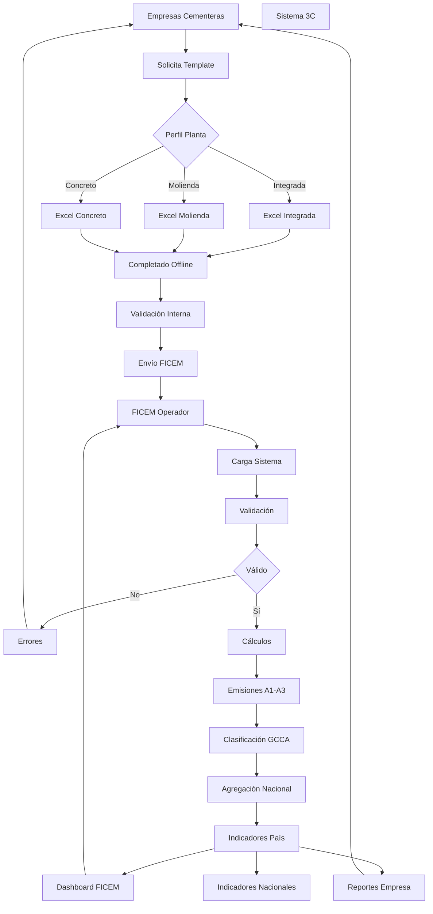

# Diagrama de Flujo General - Etapa 1

```mermaid
graph TD
    A[Empresas Cementeras]
    B[FICEM Operador]
    C[Sistema 3C]
    D[Indicadores Nacionales]

    A --> E[Solicita Template]
    E --> F{Perfil Planta}

    F -->|Integrada| G[Excel Integrada]
    F -->|Molienda| H[Excel Molienda]
    F -->|Concreto| I[Excel Concreto]

    G --> J[Completado Offline]
    H --> J
    I --> J

    J --> K[Validación Interna]
    K --> L[Envío FICEM]

    L --> B
    B --> M[Carga Sistema]
    M --> N[Validación]
    N --> O{Válido}

    O -->|No| P[Errores]
    P --> A
    O -->|Sí| Q[Cálculos]

    Q --> R[Emisiones A1-A3]
    R --> S[Clasificación GCCA]
    S --> T[Agregación Nacional]
    T --> U[Indicadores País]

    U --> V[Dashboard FICEM]
    U --> W[Reportes Empresa]
    U --> D

    V --> B
    W --> A
```