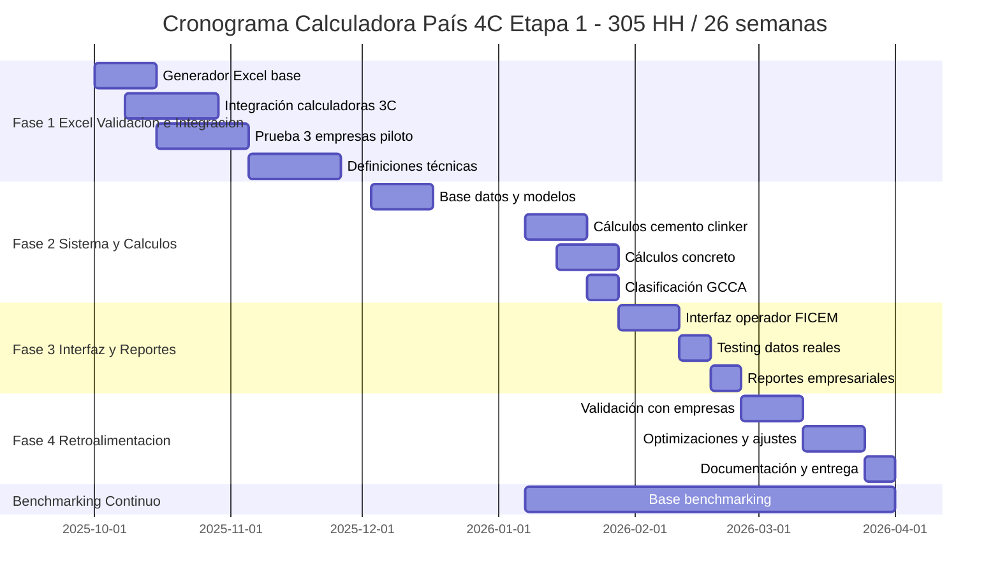

# Gantt Etapa 1 - Calculadora País 4C

```mermaid
gantt
    title Cronograma Calculadora País 4C Etapa 1 - 305 HH / 26 semanas
    dateFormat YYYY-MM-DD

    section Fase 1 Excel Validacion e Integracion
    Generador Excel base          :gen, 2025-10-01, 14d
    Integración calculadoras 3C   :calc, 2025-10-08, 21d
    Prueba 3 empresas piloto      :test, 2025-10-15, 21d
    Definiciones técnicas         :def, 2025-11-05, 21d

    section Fase 2 Sistema y Calculos
    Base datos y modelos          :bd, 2025-12-03, 14d
    Cálculos cemento clinker      :calc1, 2026-01-07, 14d
    Cálculos concreto            :calc2, 2026-01-14, 14d
    Clasificación GCCA           :gcca, 2026-01-21, 7d

    section Fase 3 Interfaz y Reportes
    Interfaz operador FICEM      :ui, 2026-01-28, 14d
    Testing datos reales         :real, 2026-02-11, 7d
    Reportes empresariales       :rep, 2026-02-18, 7d

    section Fase 4 Retroalimentacion
    Validación con empresas      :val, 2026-02-25, 14d
    Optimizaciones y ajustes     :opt, 2026-03-11, 14d
    Documentación y entrega      :doc, 2026-03-25, 7d

    section Benchmarking Continuo
    Base benchmarking            :bench, 2026-01-07, 84d
```