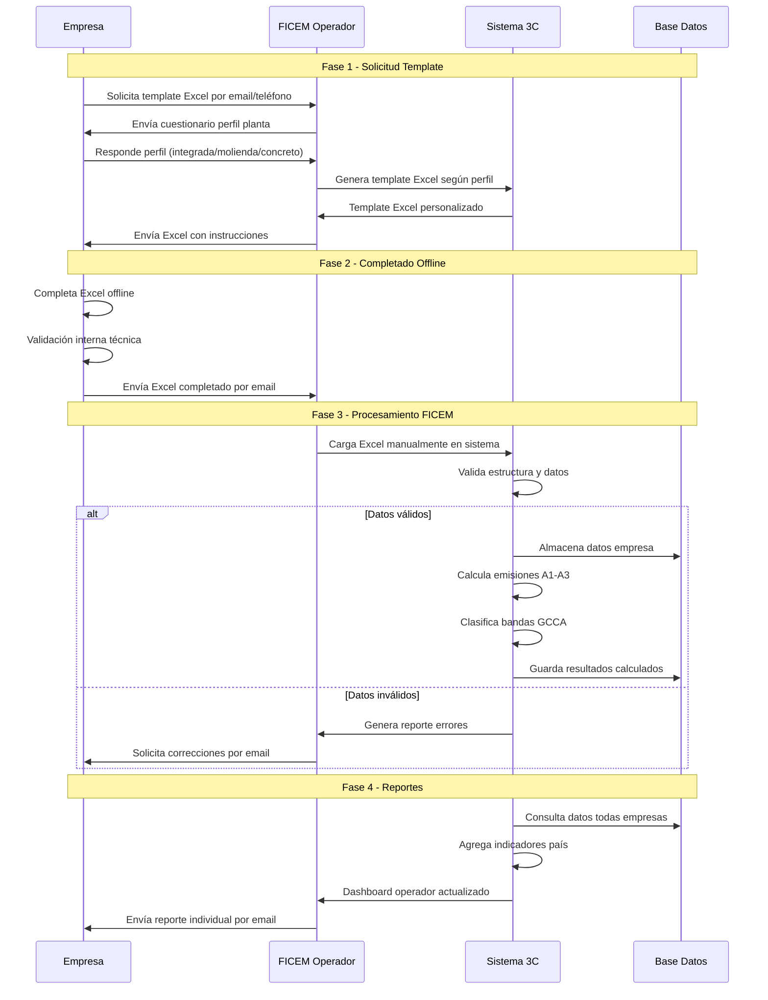

# Secuencia Temporal Detallada - Etapa 1

```mermaid
sequenceDiagram
    participant E as Empresa
    participant F as FICEM Operador
    participant S as Sistema 3C
    participant D as Base Datos

    Note over E,D: Fase 1 - Solicitud Template
    E->>F: Solicita template Excel por email/teléfono
    F->>E: Envía cuestionario perfil planta
    E->>F: Responde perfil (integrada/molienda/concreto)
    F->>S: Genera template Excel según perfil
    S->>F: Template Excel personalizado
    F->>E: Envía Excel con instrucciones

    Note over E,D: Fase 2 - Completado Offline
    E->>E: Completa Excel offline
    E->>E: Validación interna técnica
    E->>F: Envía Excel completado por email

    Note over E,D: Fase 3 - Procesamiento FICEM
    F->>S: Carga Excel manualmente en sistema
    S->>S: Valida estructura y datos
    alt Datos válidos
        S->>D: Almacena datos empresa
        S->>S: Calcula emisiones A1-A3
        S->>S: Clasifica bandas GCCA
        S->>D: Guarda resultados calculados
    else Datos inválidos
        S->>F: Genera reporte errores
        F->>E: Solicita correcciones por email
    end

    Note over E,D: Fase 4 - Reportes
    S->>D: Consulta datos todas empresas
    S->>S: Agrega indicadores país
    S->>F: Dashboard operador actualizado
    F->>E: Envía reporte individual por email
```