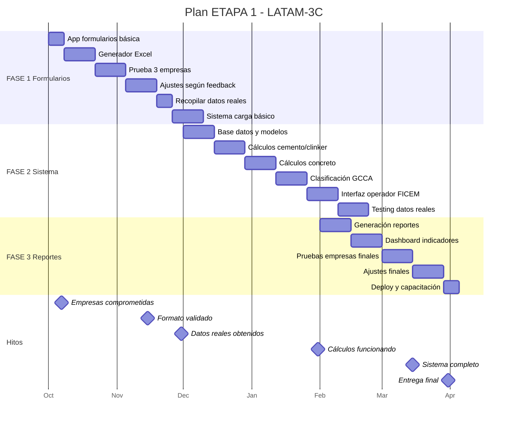

# Diagrama Gantt - ETAPA 1 LATAM-3C

## Timeline: Octubre 2024 - Marzo 2025



## Versión ASCII (alternativa)

```
ACTIVIDAD                       OCT    NOV    DIC    ENE    FEB    MAR
                              |------|------|------|------|------|------|
                              S1 S2 S3 S4|S1 S2 S3 S4|S1 S2 S3 S4|S1 S2 S3 S4|S1 S2 S3 S4|S1 S2 S3 S4

FASE 1: FORMULARIOS (160 HH)
App formularios básica         ██
Generador Excel                   ████
Prueba 3 empresas                     ████
Ajustes según feedback                    ████
Recopilar datos reales                        ██
Sistema carga básico                          ████

FASE 2: SISTEMA PRINCIPAL (200 HH)
Base datos y modelos                                ████
Cálculos cemento/clinker                               ████
Cálculos concreto                                          ████
Clasificación GCCA                                             ████
Interfaz operador FICEM                                            ████
Testing datos reales                                                  ██

FASE 3: REPORTES (180 HH)
Generación reportes                                                        ████
Dashboard indicadores                                                          ████
Pruebas empresas finales                                                          ████
Ajustes finales                                                                      ████
Deploy y capacitación                                                                    ██

HITOS CRÍTICOS
✓ Empresas comprometidas       ▲
✓ Formato validado                    ▲
✓ Datos reales obtenidos                     ▲
✓ Cálculos funcionando                                    ▲
✓ Sistema completo                                                           ▲
✓ Entrega final                                                                       ▲

DISPONIBILIDAD EMPRESAS
Alta                           ████████████████
Baja (vacaciones)                              ████████████████
Media                                                          ████████████████████████

```

## Leyenda
- ██ = Trabajo activo
- ▲ = Hito/Milestone
- Semanas (S1-S4) por mes

## Carga de trabajo
- **Oct-Nov**: 160 HH (80 HH/mes = 20h/semana)
- **Dic-Ene**: 200 HH (100 HH/mes = 25h/semana)
- **Feb-Mar**: 180 HH (90 HH/mes = 22.5h/semana)
- **Promedio**: 22.5 horas/semana

## Dependencias críticas
1. Formularios → Validación empresas → Datos reales
2. Datos reales → Desarrollo sistema → Testing
3. Sistema completo → Pruebas finales → Entrega