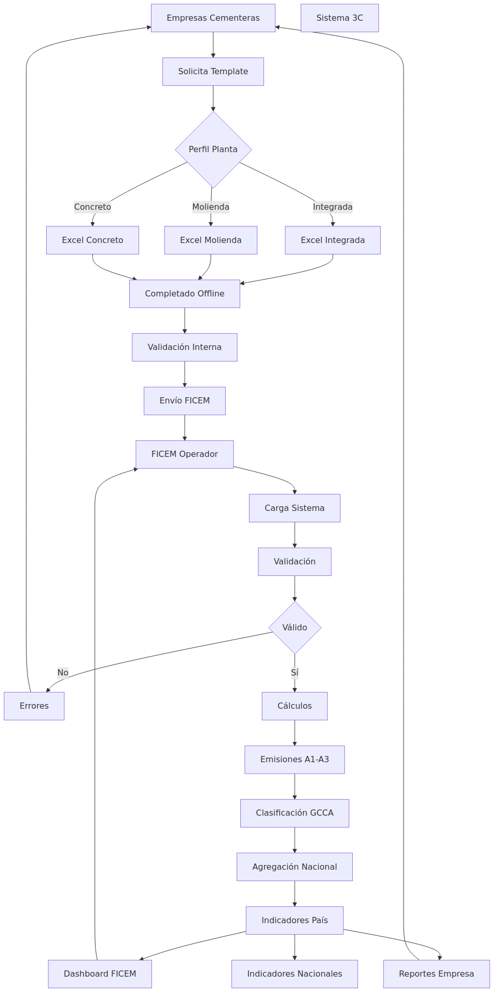
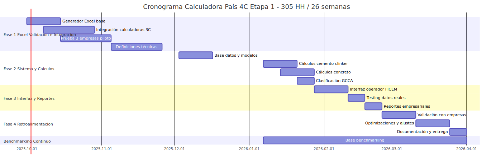

# PROPUESTA TÉCNICO-ECONÓMICA
## Calculadora País 4C de Huella de Carbono - ETAPA 1

**Cliente:** FICEM (Federación Interamericana del Cemento)
**Fecha:** Octubre 2025
**Período de ejecución:** Octubre 2025 - Marzo 2026 (26 semanas)

---

## 1. RESUMEN EJECUTIVO

La Calculadora País 4C permitirá a FICEM gestionar de manera centralizada el cálculo de huella de carbono para productos de clinker, cementos y concretos de empresas de América Latina, siguiendo los estándares oficiales GCCA (Global Cement and Concrete Association) y las metodologías de la Calculadora 3C de FICEM.

### Inversión Total
**$25,000 USD**

### Modelo Operativo Etapa 1
**Operador Centralizado**: FICEM procesa todos los datos de las empresas mediante una aplicación web especializada, eliminando la necesidad de que cada empresa tenga acceso directo al sistema.

### Relación con Calculadora 3C Corporativa

La Calculadora País 4C es **complementaria** a la Calculadora 3C, no una versión mejorada. Ambas tienen propósitos distintos:

**Calculadora 3C** (Individual Corporativa):
- Gestión detallada por empresa (planta por planta, línea por línea)
- Reportería corporativa propia
- Requiere contratación individual

**Calculadora País 4C** (Agregada Sectorial) - Lo que NO hace la 3C:
- ✅ **Agregación multi-empresa**: Consolida datos de todas las empresas participantes bajo control de FICEM
- ✅ **Benchmarking anónimo**: Genera rangos percentiles (P25, P50, P75) sin exponer identidades
- ✅ **Reportería nacional**: Produce indicadores que FICEM presenta ante organismos internacionales
- ✅ **Visión LATAM**: Compara desempeño de Perú vs otros países de la región
- ✅ **Inclusión universal**: Permite participar a empresas sin calculadora 3C mediante Excel anualizado
- ✅ **Control gremial**: FICEM valida consistencia y genera reportes sectoriales

Las empresas **con** 3C pueden exportar automáticamente (ahorro de tiempo). Las que **no** la tienen pueden participar igualmente con datos anualizados simplificados.

---

## 2. DESCRIPCIÓN DEL PROCESO

La Calculadora País 4C transforma datos operativos dispersos en indicadores estandarizados de huella de carbono, facilitando la gestión centralizada por FICEM y proporcionando valor agregado tanto a nivel federativo como empresarial.

### Flujo Operativo

### Cómo Funciona el Sistema

**1. Recopilación Inteligente de Datos**

El sistema ofrece **dos modalidades de captura** para incluir a todo el sector:

- **Opción A - Empresas sin Calculadora 3C**: Plantilla Excel anualizada simplificada con datos agregados de producción, consumos energéticos totales y materiales. Periodicidad anual, alineada con inventarios GEI corporativos. El sistema provee template, validaciones automáticas y soporte para llenado correcto.

- **Opción B - Empresas con Calculadora 3C**: Exportación automática desde su calculadora corporativa existente, eliminando re-ingreso manual. Durante Fase 1 se actualiza la calculadora 3C con módulo de exportación.

Ambas modalidades alimentan el mismo motor de cálculos GCCA. La gestión de empresas sin calculadora **está incluida** en el proyecto.

**2. Validación Multinivel**

Al cargar cada archivo, el sistema ejecuta validaciones automáticas que van desde verificación de formato (estructura de hojas, campos requeridos) hasta coherencia de datos (rangos esperados, sumas de composiciones al 100%, consistencia entre volúmenes y densidades). Los errores se reportan de inmediato con indicaciones precisas para su corrección, minimizando ciclos de retroalimentación.

**3. Motor de Cálculos GCCA**

El corazón del sistema procesa las emisiones siguiendo rigurosamente el protocolo GCCA. Calcula emisiones de proceso (calcinación del clinker), combustibles (considerando factores de emisión específicos por tipo), y electricidad. Para concreto, integra la huella del cemento con las emisiones de transporte y producción de agregados. Los resultados típicos oscilan entre 750-950 kg CO₂e/ton para clinker, 400-900 kg CO₂e/ton para cemento, y 150-500 kg CO₂e/m³ para concreto.

**4. Clasificación y Benchmarking**

Cada producto calculado se clasifica automáticamente en bandas GCCA (A-G para cementos, AA-F para concretos) comparándolo contra benchmarks internacionales. Simultáneamente, el sistema agrega datos de forma anónima para construir curvas de referencia por país y región, permitiendo que cada empresa visualice su posición relativa sin exponer identidades.

**5. Generación de Reportes y Curvas**

FICEM accede a un dashboard consolidado con métricas nacionales, promedios por categoría, y evolución temporal. Cada empresa recibe reportes individuales con su clasificación GCCA, gráficos comparativos anónimos de CO₂ vs resistencia (para concretos), y recomendaciones basadas en su posicionamiento. Los indicadores agregados se exportan para análisis sectoriales y comunicación institucional.

---

## 3. ALCANCE Y ENTREGABLES

### 3.1 Sistema Core

#### FASE 1: Generador Excel, Validación e Integración Calculadoras
**Entregables:**
- Generador dinámico de plantillas Excel personalizadas según perfil de empresa
- Sistema de validación de estructura y datos
- Templates validados con 3 empresas piloto (2 con calculadora corporativa)
- Upgrade completo de 2 calculadoras corporativas 3C existentes
- Módulo de exportación automática desde calculadoras a formato Excel
- Definiciones técnicas acordadas (metodologías de medición de resistencia, etc.)
- Formato Excel definitivo estandarizado

**Funcionalidades:**
- Generación de 5-10 hojas Excel según tipo de planta (integrada, molienda, concreto)
- Validaciones de datos integradas (listas desplegables, rangos numéricos)
- Instrucciones contextuales por tipo de empresa
- Detección automática de errores de formato
- Exportación directa desde calculadoras corporativas sin re-ingreso manual

#### FASE 2: Sistema Principal y Cálculos
**Entregables:**
- Base de datos operativa (SQLite) con modelos completos
- Motor de cálculos para productos de cemento (A1: Clinker, A2: Cemento)
- Motor de cálculos para productos de concreto (A3)
- Sistema de clasificación GCCA (bandas A-G para cemento, AA-F para concreto)
- Interfaz web para operador FICEM
- Sistema validado con datos reales de 5+ empresas

**Funcionalidades de cálculo:**
- Factor clínker/cemento por tipo de producto
- Emisiones de proceso (calcinación)
- Emisiones por combustibles (integración con datos GCCA)
- Huella de carbono por m³ de concreto
- Indicadores por resistencia (f'c)
- Clasificación automática según benchmarks internacionales

#### FASE 3: Interfaz y Reportes
**Entregables:**
- Dashboard principal con métricas clave
- Sistema de carga masiva de archivos Excel
- Reportes individuales por empresa (Excel)
- Reportes comparativos simplificados
- Sistema de exportación de resultados

**Funcionalidades:**
- Filtros dinámicos por país/empresa/año
- Visualización de resultados de cálculos
- Indicadores de progreso de procesamiento
- Exportación personalizable de datos

### 3.2 Base de Datos de Benchmarking (Fase Continua)
**Alcance:**
- Diseño e implementación de repositorio de referencias
- Sistema de agregación anónima de datos por país/región
- Visualizaciones comparativas (curvas CO2 vs resistencia, indicadores sectoriales)
- Integración en reportes empresariales
- Actualización continua durante todo el proyecto

**Beneficio:** Cada empresa recibirá contexto comparativo anónimo que le permita evaluar su desempeño relativo y identificar oportunidades de mejora.

---

## 4. ARQUITECTURA TÉCNICA

### Stack Tecnológico
- **Frontend/Interface:** Streamlit (Python)
- **Backend:** Python 3.8+
- **Base de datos:** SQLite
- **Procesamiento:** Pandas, SQLAlchemy
- **Generación Excel:** openpyxl

### Justificación Técnica
- **Streamlit:** Desarrollo rápido de interfaces especializadas para operador único
- **SQLite:** Adecuado para volumen de datos esperado (50-100 empresas/año)
- **Python:** Ecosistema robusto para procesamiento de datos científicos

---

## 5. CRONOGRAMA DETALLADO

### Estructura Temporal
**Duración:** 26 semanas (01 octubre 2025 - 31 marzo 2026)

| Fase | Semanas | Período | Costo |
|------|---------|---------|-------|
| **Fase 1: Excel, Validación + Calculadoras** | 1-8 | Oct-Nov 2025 | $6,000 |
| **Fase 2: Sistema y Cálculos** | 9-15 | Dic 2025 - Ene 2026 | $9,500 |
| **Fase 3: Interfaz y Reportes** | 16-20 | Ene-Feb 2026 | $4,900 |
| **Fase 4: Retroalimentación y Mejoras** | 21-26 | Feb-Mar 2026 | $1,900 |
| **Base Datos Benchmarking (continua)** | 10-26 | Ene-Mar 2026 | $2,700 |
| **TOTAL** | **26 semanas** | - | **$25,000** |

### Hitos Clave

**26 Nov 2025 (Semana 8):** Formato Excel validado + Upgrade calculadoras completado
**14 Ene 2026 (Semana 15):** Motor de cálculos A1-A3 operativo
**18 Feb 2026 (Semana 20):** Sistema completo en producción
**31 Mar 2026 (Semana 26):** Entrega final optimizada y validada

### Visualización Gantt

---

## 6. GESTIÓN DE RIESGOS

### Riesgos Identificados y Mitigación

| Riesgo | Probabilidad | Impacto | Mitigación |
|--------|--------------|---------|------------|
| Formatos Excel variables por empresa | Media | Alto | Validación temprana (semanas 3-8) con 3 empresas piloto |
| Definiciones técnicas requieren consenso extenso | Media | Medio | 8 semanas en Fase 1 permiten discusiones técnicas necesarias |
| Datos reales incompletos para benchmarking | Media | Bajo | Sistema de agregación flexible, enriquecimiento continuo |
| Período vacacional afecta continuidad | Alta | Medio | Cronograma planificado con semanas intensas pre y post-vacaciones |
| Cambios en especificaciones GCCA | Baja | Alto | Arquitectura modular permite ajustes rápidos |

### Supuestos Críticos
- 3 empresas comprometidas para validación inicial (semanas 3-8)
- 2 de las 3 empresas piloto tienen calculadoras corporativas accesibles para upgrade

---

## 7. BENEFICIOS Y VALOR GENERADO

### Para FICEM
- ✅ **Control centralizado** del proceso de cálculo para toda la región
- ✅ **Estandarización** de metodología GCCA en América Latina
- ✅ **Visibilidad sectorial** mediante benchmarking anónimo
- ✅ **Reducción de tiempos** de procesamiento anual
- ✅ **Base sólida** para Etapa 2 (portal empresarial)

### Para Empresas Participantes
- ✅ **Templates Excel claros** adaptados a su perfil operativo
- ✅ **Clasificación GCCA oficial** de sus productos
- ✅ **Reportes comparativos** anónimos (benchmarking)
- ✅ **Upgrade de calculadoras corporativas** 3C existentes con exportación automática (2 empresas)
- ✅ **Reducción de errores** mediante validaciones automáticas
- ✅ **Eliminación de re-ingreso manual** para empresas con calculadora

### ROI Esperado
- **Tiempo ahorrado:** La automatización de validaciones, cálculos y clasificación GCCA elimina procesos manuales iterativos y reduce significativamente los ciclos de corrección
- **Precisión mejorada:** Eliminación de errores de cálculo manual
- **Escalabilidad:** Sistema preparado para crecer de 10 a 100+ empresas
- **Conocimiento sectorial:** Base de datos de benchmarking construida progresivamente

---

## 8. PROYECCIÓN FUTURA - ETAPA 2

### Visión de Escalamiento
Una vez validado el proceso en Etapa 1, la **Etapa 2** transformará el modelo operativo:

**Modelo futuro:** Portal de autoservicio donde cada empresa gestiona sus datos directamente

**Tecnologías:** React/Vue + FastAPI + PostgreSQL + Hosting cloud escalable

**Nuevas funcionalidades:**
- Autenticación por empresa
- Formularios web dinámicos (eliminación de Excel)
- Dashboards interactivos en tiempo real
- API REST para integraciones
- Gestión multi-año
- Infraestructura de hosting profesional

**Criterio de activación:** Proceso validado y estable en Etapa 1 + propuesta técnico-económica detallada de Etapa 2

---

## 9. CONDICIONES COMERCIALES

### Modalidad de Pago

**Por Fase (Recomendada):**
- **Pago 1 (20% inicial)** al firmar contrato: **$5,000** (01 Oct 2025)
- **Pago 2 (Fase 1)** al completar Excel + Calculadoras: **$6,000** (26 Nov 2025)
- **Pago 3 (Fase 2)** al completar motor de cálculos: **$9,500** (14 Ene 2026)
- **Pago 4 (Fase 3)** al completar interfaz y reportes: **$4,900** (18 Feb 2026)
- **Pago 5 (Fase 4 + Benchmarking)** entrega final completa: **$4,600** (31 Mar 2026)

**Total:** $25,000 distribuido en 5 pagos alineados a entregables concretos

*Nota: El componente de Benchmarking ($2,700) se desarrolla de forma continua desde enero hasta marzo y se liquida en el pago final.*

### Incluye
- Código fuente completo con licencia de uso
- Documentación técnica completa
- Documentación de usuario para operador FICEM
- Manual de resolución de problemas
- 4 meses de soporte post-entrega (ajustes menores)
- Transferencia de conocimiento

### Garantía
- **Funcionalidad:** El sistema cumplirá con todas las especificaciones detalladas
- **Correcciones:** Bugs críticos corregidos sin costo durante 30 días post-entrega
- **Soporte:** Consultas técnicas respondidas durante período de garantía

---

**Fecha de vigencia de la propuesta:** 30 días

**Firma de conformidad:**

_________________________
**Carlos Enrique Pinilla Matamala**
Omniscien Analítica Ambiental
Desarrollador Principal

---

*Documento generado: Octubre 2025*
*Versión: 1.0 - Propuesta Técnico-Económica Etapa 1*
