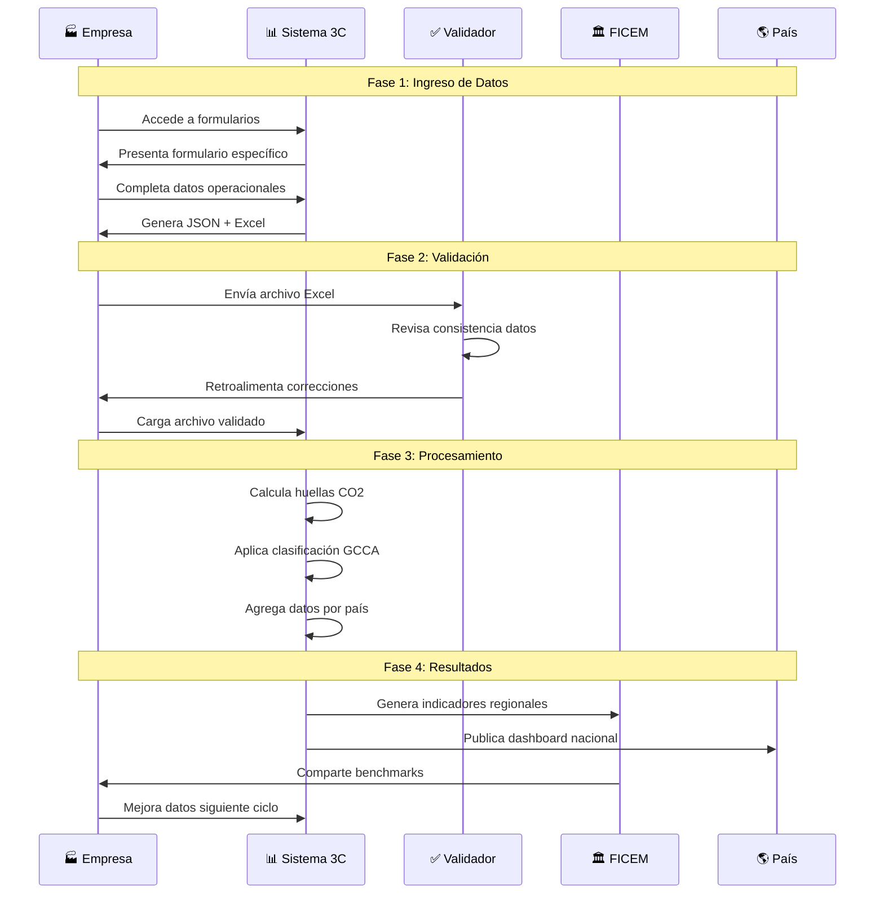
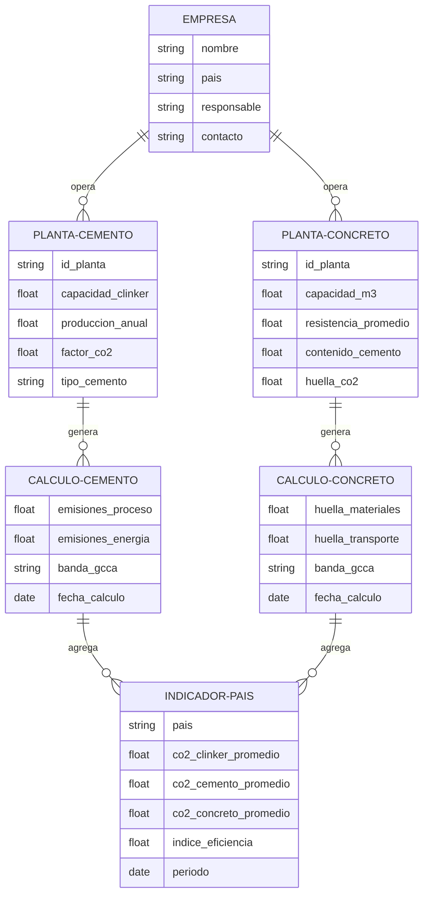
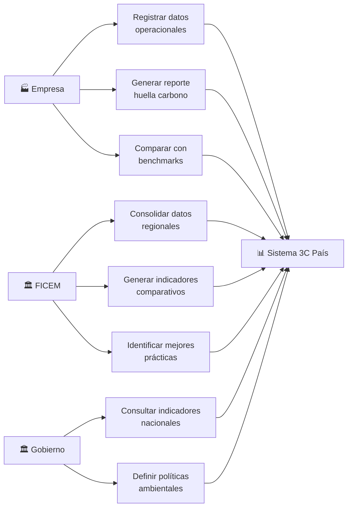

# Diagrama de Flujo - Calculadora 3C País

## Proceso Completo: Recopilación y Análisis de Datos

```mermaid
graph TD
    %% Actores principales
    A[🏭 Empresas Cementeras<br/>y Concreteras] 
    B[🏛️ FICEM<br/>Federación]
    C[📊 Sistema 3C País<br/>Calculadora]
    D[🌎 Países LATAM<br/>Indicadores Nacionales]

    %% Proceso de ingreso de datos
    A --> E[📝 Acceso a Formularios<br/>Ingreso de Datos]
    E --> F{Tipo de Planta}
    
    F -->|Cemento| G[🏭 Formulario Cemento<br/>• Datos empresa<br/>• Datos planta<br/>• Producción clínker<br/>• Composición cemento<br/>• Emisiones proceso]
    F -->|Concreto| H[🚛 Formulario Concreto<br/>• Datos empresa<br/>• Datos planta<br/>• Dosificaciones<br/>• Resistencias<br/>• Transporte]

    %% Generación de archivos
    G --> I[📊 Generación Excel<br/>Plantilla validable]
    H --> I

    %% Validación y carga
    I --> J[✅ Validación Externa<br/>Revisión técnica]
    J --> K[🔄 Carga al Sistema<br/>Base de datos]

    %% Procesamiento y cálculos
    L --> M[⚙️ Motor de Cálculos]
    M --> N[🧮 Cálculo Huellas CO2<br/>• Cemento: Factor emisión<br/>• Concreto: Huella total]
    N --> O[📈 Clasificación GCCA<br/>• Bandas cemento (A-G)<br/>• Bandas concreto (AA-F)]

    %% Agregación por país
    O --> P[🌐 Agregación Nacional<br/>Consolidación datos]
    P --> Q[📊 Indicadores País<br/>• CO2/Clínker<br/>• CO2/Cemento<br/>• CO2/Concreto<br/>• CO2/Resistencia]

    %% Outputs finales
    Q --> R[🎯 Dashboard Nacional<br/>Visualizaciones]
    Q --> S[📋 Reportes FICEM<br/>Comparativos regionales]
    Q --> T[🌍 Benchmarking<br/>Internacional]

    %% Feedback loop
    S --> B
    B --> U[📢 Políticas y<br/>Mejores Prácticas]
    U --> A

    %% Estilos
    classDef empresa fill:#e1f5fe,stroke:#0277bd,stroke-width:2px
    classDef sistema fill:#f3e5f5,stroke:#7b1fa2,stroke-width:2px
    classDef proceso fill:#e8f5e8,stroke:#388e3c,stroke-width:2px
    classDef output fill:#fff3e0,stroke:#f57c00,stroke-width:2px

    class A,E,F,G,H empresa
    class C,I,J,L,M,N,O,P sistema
    class K,U proceso
    class Q,R,S,T,D output
```

## Flujo de Datos Detallado



## Arquitectura de Datos



## Casos de Uso Principales


